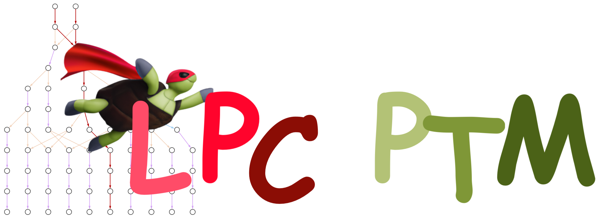

This repository demonstrates a **_low_**-performance (LPC) simulator of noisy quantum circuit expectation values using the Pauli transfer matrix (PTM) formalism, and [Rudolph](https://github.com/MSRudolph) _et al_'s [truncation methods](https://arxiv.org/abs/2308.09109). It prototypes an extension of the [QIC](https://www.epfl.ch/labs/qic/) group's [LOWESA](https://arxiv.org/abs/2306.05400) simulator (in _"breadth-first mode"_) to support:
- A wider family of non-Clifford canonical operators.
- Operators which map a Pauli string to _more than two_ output strings.
- Operators which are non-CPTP, such as rotations with complex parameters.
- Operators specified as general matrices and Kraus maps.
- Operators containing _multiple_ parameters and arbitrary symbolic expressions.
- Runtime computation and caching of Pauli transfer matrices (as _maps_).
- Efficient storage of Pauli strings as arbitrary-precision integers.
- Efficient merging of incident Pauli strings during simulation.
- Easier development through a modular design.

An introduction to PTM simulation is given in [`THEORY.md`](THEORY.md), and an interactive demo of using the simulator is found in [`main.ipynb`](main.ipynb) (or as a raw script in [`main.py`](main.py)).

We caution that this repository is _not_ a practical simulation tool, and you will find it painfully slow to run (it's pure [Python](https://www.python.org/)!). It instead serves as a pedagogical demonstration of PTM simulation, and as a prototype for future LOWESA development in [Julia](https://julialang.org/).