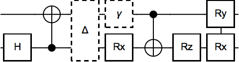
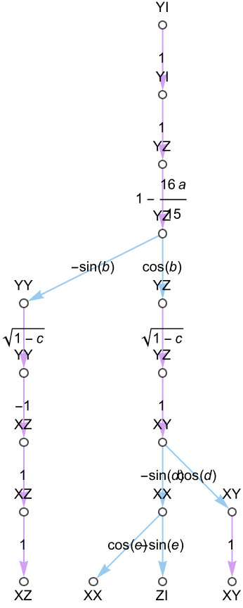
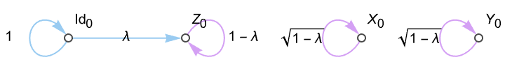
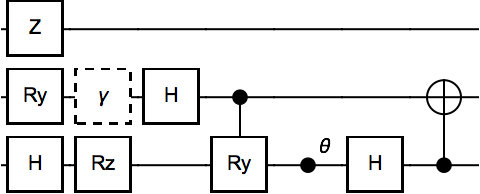
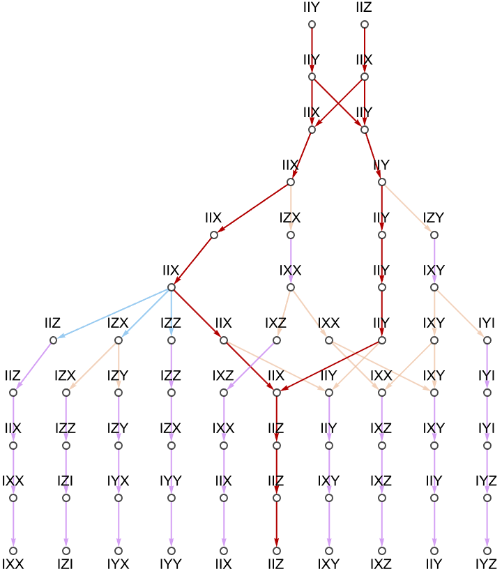
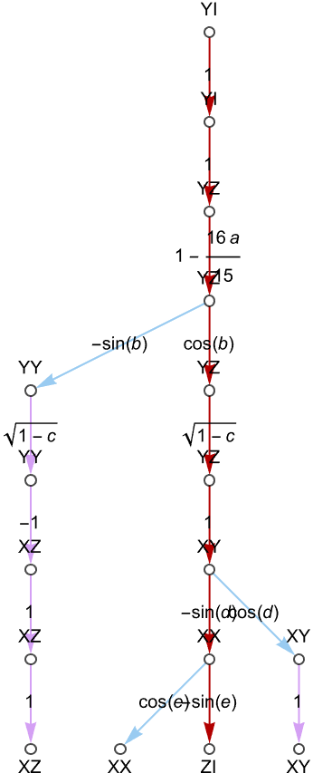
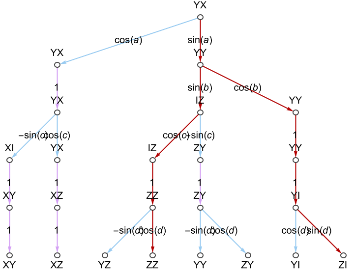
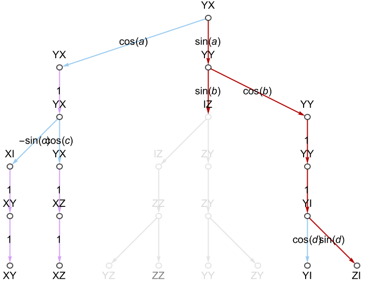

Theory and Algorithm
=======


This page explains the simulation method of this repository, which extends the functionality of [LOWESA](https://arxiv.org/abs/2308.09109). Almost all of my understanding of the Pauli transfer matrix (PTM) formalism is learned from the inexhaustible [Manuel Rudolph](https://github.com/MSRudolph), although the inevitable mistakes herein are my own.


-----------------------

# PTMs


Consider a parameterised quantum channel $\hat{\mathcal{D}}_{\vec{\theta}}$ which acts upon the zero state $\ket{0}\bra{0}$. We wish to find the output state's expectation value $\braket{\hat{O}(\vec{\theta}})$ with respect to a Hermitian operator $\hat{O}$ - perhaps as a symbolic function of the circuit parameters $\vec{\theta} \in \mathbb{R}^{p}$, or at a sequence of specific coordinates $\vec{\theta_1},\, \dots, \, \vec{\theta_n}$ as is typical in [variational algorithms](https://www.nature.com/articles/s42254-021-00348-9). Analytically, this value is given by

$$
    \braket{\hat{O}(\vec{\theta}}) = \text{Tr}\left( \hat{O} \, \hat{\mathcal{D}}_{\vec{\theta}}(\ket{0}\bra{0}) \right)
$$

although for non-trivial channels, we cannot precisely evaluate this expression, and must resort to simulation.


Because we are only interested in _expectation values_, rather than say probabilities or querying particular amplitudes, we can use a [_weak simulation_](https://journals.aps.org/pra/abstract/10.1103/PhysRevA.91.012334) method. This may offer a speedup over _strong_ methods like [full-state simulation](https://arxiv.org/abs/2311.01512). One such weak method is via _Pauli transfer matrix_ simulation, combined with [truncation techniques](https://arxiv.org/abs/2308.09109) to curtail the otherwise prohibitively growing simulation costs.


The _Pauli transfer matrix_ (PTM) of an $N$-qubit channel $\hat{\mathcal{D}}$ encodes how the channel operates upon, and changes the overlap of, Pauli strings:

$$
\text{PTM}(\hat{\mathcal{D}})_{ij} = \text{Tr}\left( \hat{P}_i \; \hat{\mathcal{D}}(\hat{P}_j) \right)
$$

where $\hat{P}_i$ is the $i$-th $N$-qubit Pauli string:

$$
    \hat{P}_i = \bigotimes\limits_{n}^N \hat{\sigma}_n^{(i)}, \;\;\;\;\;\;  \hat{\sigma}_n^{(i)} \in \{\hat{I}, \hat{X}, \hat{Y}, \hat{Z}\}.
$$

Let's assume that our observable of interest $\hat{O}$ is already given in the Pauli basis - i.e. is a real weighted $m$-term sum of Pauli strings, as is customary in quantum computing:

$$
    \hat{O} \equiv \sum_i^m \alpha_i \, \hat{P}_i, \;\;\;\; \alpha_i \in \mathbb{R}.
$$

We notate this as a vector

$$
    \ket{\ket{\hat{O}}} = \{ \alpha_0, \; \alpha_1, \; \dots, \; \alpha_{4^{N}-1} \}
$$

although we avoid numerically instantiating this dense form since practial operators have only $m \sim \mathcal{O}(\text{poly}(N)) \ll 4^N$ non-zero weights $\alpha_i$.
Note that in our subsequent simulation, $\alpha_i$ are permittedly complex (so that $\hat{O}$ isn't actually Hermitian), and can be _symbolically parameterised_, but we'll keep our notation here simple.

We can also express our initial $Z$-basis state in the Pauli basis:

$$
    \ket{0}\bra{0} \sim \bigotimes_n^N \left( \hat{I}_n + \hat{Z}_n \right) 
$$

which expands to a uniform sum of $2^N$ Pauli strings; all permutations of $\hat{I}$ and $\hat{Z}$. This is quadratically fewer strings than the total number of $N$-qubit Pauli strings, i.e. $4^N$. Let $\ket{\ket{0}}$ denote the vector of the weights of these Pauli strings, which happen to be $0$ or $1$, neglecting superfluous normalisation.

The expectation value has become

$$
\braket{\hat{O}(\vec{\theta})} = \bra{\bra{0}} \, \text{PTM}(\hat{\mathcal{D}}_{\vec{\theta}}) \, \ket{\ket{\hat{O}}}.
$$

Assume our $N$-qubit channel $\hat{\mathcal{D}}$ is a composition of smaller $\mathcal{O}(1)$-dimensional channels $\hat{g}^{k}_{\vec{\theta}}$, like few-qubit operators. Then

$$
\text{PTM}(\hat{\mathcal{D}}_{\vec{\theta}}) = \prod_k \text{PTM}(\hat{g}^{k}_{\vec{\theta}})
$$


These equations suggest we can take a noisy $N$-qubit circuit $\hat{\mathcal{D}}$ described as a sequence of local operators $\hat{g}^k$, compute the Pauli transfer matrix of each, and multiply them in-turn upon the Pauli-basis vector $\ket{\ket{\hat{O}}} \in \mathbb{R}^{4^N}$, before finally computing an inner-product with the Pauli-basis initial state $\bra{\bra{0}}$. This isn't very appealing; the $\mathcal{O}(4^N)$ memory and runtime is just as costly as full-state simulation, even after assigning $\vec{\theta}$ to fixed values.

Thankfully, the PTM formalism permits a number of tricks to speed things up.


----------------------------


# PTMs are _sparse_


The first trick is to exploit that for many canonical operators $\hat{g}^k$, its corresponding $\text{PMT}(\hat{g}^k)$ has _few_ non-zero elements in every column. This means operating it upon a Pauli-basis state (i.e. a Pauli string) will produce _few_ output states, and be (in my words) _"few branching"_. For example, consider the PTMs of the Hadamard gate, $\hat{X}$-rotation and the amplitude damping channel.

$$ \text{PTM}(\text{H}) = \begin{pmatrix} 1 \\ & & & 1 \\ & & -1 \\ & 1 \end{pmatrix}
$$

$$ \text{PTM}( \text{Rx}(\theta)) = \begin{pmatrix} 1 \\ & 1 \\ & & \cos(\theta) & -\sin(\theta) \\ & & \sin(\theta) & \cos(\theta) \end{pmatrix} $$

$$ \text{PTM}(\text{Damping}(\lambda)) = \begin{pmatrix} 1 \\ & \sqrt{1-\lambda} \\ & & \sqrt{1-\lambda} \\ \lambda & & & 1-\lambda \end{pmatrix} $$

These are all examples of _one_ or _two_-branching operators, whereby

$$
    \text{PTM}(\text{H}) \, \hat{P}_i = \pm\, \hat{P}_j
$$

$$
\text{PTM}(\text{Damping}(\lambda)) \hat{P}_i = \begin{cases}
\hat{I} + \lambda \, \hat{Z}, & \hat{P}_i = \hat{I} \\
\sqrt{1-\lambda} \,\hat{P}_i, & \hat{P}_i \in \{\hat{X}, \hat{Y}\} \\
\hat{I} - \lambda \, \hat{Z}, & \hat{P}_i = \hat{Z}
\end{cases}
$$
It is straightforward to show that all Clifford gates are one-branching (always simply mapping a Pauli string to another string), and that the following canonical operators are (at-most) two-branching: $T$ gates, rotation gates (including $n$-qubit Pauli gadgets), one and two-qubit dephasing and depolarising channels, and one-qubit amplitude damping (as above).

We could say that such operators only _"slowly grow"_ the number of Pauli strings in a weighted sum. In contrast, operators like the four-branching controlled-Hadamard, whereby
$$
\text{PTM}( \, \text{C}(\text{H}) \, ) \cdot \left(\hat{I}\otimes\hat{X}\right)
=
\frac{1}{2} \hat{I}\otimes\hat{X} +
\frac{1}{2} \hat{I}\otimes\hat{Z} +
\frac{1}{2} \hat{Z}\otimes\hat{Z} -
\frac{1}{2} \hat{Z}\otimes\hat{Z}
$$
much more quickly grow the ensemble. So if we restrict our input noisy circuit to few-branching operators, then we need _not_ instantiate $\ket{\ket{\hat{O}}}$ as a dense $4^N$-length vector. Instead, we could keep track of the individual non-zero-weighted Pauli strings $\{ \alpha_i \, \hat{P}_i : i \}$ in some dynamic list structure. Applying a one-branching operator like $\text{CNOT}$, or depolarising noise, requires only remapping each $\hat{P}_i$ to a $\hat{P}_j$; and this is an easy task we can perform in $\mathcal{O}(1)$ or at worse $\mathcal{O}(N)$ time. Applying a two-branching operator like $\text{Rz}(\theta)$ can, _at worst_, _double_ the number of Pauli strings maintained in our ensemble. In practice, the number of strings grows more slowly.

## Example

Consider, for example, the parameterised circuit (written as a reverse product)
$$
\hat{\mathcal{D}}(a,b,c,d,e) \coloneqq \hat{\text{H}}_0 \; \text{CNOT}_{0,1} \; \text{Depol}_{0,1}(a) \; \text{Rx}_0(b) \; \text{Damp}_1(c) \; \text{CNOT}_{1,0} \; \text{Rz}_0(d) \; \exp(- i \, e/2 \, \hat{Y}_1 \hat{X}_0)
$$
which resembles

<p align="center">

</p>

Let's seek the expectation value of observable $\hat{O} = \hat{Y}_1$. 

Applying the PTM of each operator in-turn upon our ensemble, initially $\{ 1\times \hat{Y}_1 \} $, produces (written compactly)

$$
YI \xrightarrow{H} YI \xrightarrow{CNOT} YZ \xrightarrow{Depol} \left(1 - \frac{16}{15}a\right) YZ 
\xrightarrow{Rx}
\left(1 - \frac{16}{15}a\right) \cos(b)\, YZ - \left(1 - \frac{16}{15}a\right) \sin(b) \, YY
$$
where we see the $\text{Rx}$ gate caused branching into $Y_1Z_0$ and $Y_1Y_0$.
From here, the $Y_1Y_0$ state is propogated by the remaining operators without further branching to become
$$
YY \xrightarrow{Damp} \sqrt{1-c} \, YY \xrightarrow{CNOT} -\sqrt{1-c} \, XZ \xrightarrow{Rz} -\sqrt{1-c} \, XZ \xrightarrow{\exp(YX)} -\sqrt{1-c} \, XZ.
$$
However, the $Y_1Z_0$ state (neglecting its existing coefficient) becomes
$$
YZ\xrightarrow{Damp} \sqrt{1-c} \, YZ \xrightarrow{CNOT} \sqrt{1-c} \, XY \xrightarrow{Rz} \cos(d)\sqrt{1-c} \, XY - \sin(d)\sqrt{1-c} \, XX
$$
and has been "two-branched" by the $\text{Rz}$ gate. The $XY$ state is unchanged by the final operator (the Pauli gadget), but the $XX$ gate is further branched into $\cos(e)\,XX - \sin(e) ZI$.

We can visualise this evolution as a graph, where nodes are Pauli strings, and edges are the transitions between them induced by an operator, weighted by elements of its PTM.

<p align="center">

</p>


The full effect of $\hat{\mathcal{D}}$ is ergo to map 
$$ 
YI \rightarrow \alpha \, XX + \beta \, XY + \gamma \, XZ + \delta \, ZI
$$
where weights $\alpha$, $\beta$, $\gamma$ and $\delta$ are products of specific elements of $\hat{\mathcal{D}}$'s PTMs. Computing the expectation value of $\hat{O}$ means summing a subset of these output weights, as we will elaborate upon in a proceeding section.
Observe that although the circuit $\hat{\mathcal{D}}$ contains _eight_ operators acting upon _two_ qubits, including _four_ operators which can cause two-branching, the final state is a superposition of only _four_ Pauli strings. This is a _quarter_ of the maximum possible of $4^2 = 16$, which is also the number of complex amplitudes in a $Z$-basis density matrix employed by a full-state simulator.

-------------------

# PTMs are _maps_

The next crucial trick is to treat operator PTMs as _maps_.

Due to the PTMs above being demonstrably sparse, we need not ever instantiate them as matrices, nor apply them via matrix multiplication upon vectors. Instead, we can use integer logic to determine whether a given operator's PTM would induce branching upon a nominated Pauli string. This avoids all multiplication and floating-point algebra which would utilise a CPU's floating-point unit (FPU). Instead, we determine the output strings of an operator using only integer arithmetic and indexing, utilising a CPU's arithmetic-logic unit (ALU). 

Here is the equivalent map of the $\text{Damping}$ channel, for which we saw the Pauli transfer matrix above.

<p align="center">

</p>

Avoiding FPUs does _not_ necessarily mean things are faster _per operator_; in fact, the resulting [control-flow branching](https://en.wikipedia.org/wiki/Branch_(computer_science)) will likely slow things down. However, it does permit us to _decouple_ the tracking of the evolving Pauli strings in the ensemble, from the calculation of their numerical (or symbolic) weights. We will see this is a very useful utility.


---------------------------

# PTM maps can be _pre-computed_ or _cached_

Computing the PTM of an $N$-qubit channel $\hat{\mathcal{D}}$ expressed generically as a set of $\mathbb{C}^{2^N\times 2^N}$ $\hat{Z}$-basis Kraus matrices is obviously exponentially costly in $N$.
$$
\text{PTM}(\hat{\mathcal{D}})_{ij} = \text{Tr}\left( \hat{P}_i \; \hat{\mathcal{D}}(\hat{P}_j) \right),
\;\;\;\;
\hat{P}_i = \bigotimes\limits_{n}^N \hat{\sigma}_n^{(i)}, 
\;\;\;\; 
\hat{\sigma}_n^{(i)} \in \{\hat{I}, \hat{X}, \hat{Y}, \hat{Z}\}.
$$
We _can_ significantly simplify its generic matrix form above
into a product of scalars and bitwise logic in order to leverage sparsity, using equivalences (derived [here](https://arxiv.org/abs/2401.16378)) such as
$$
\left[ \hat{P}_k \right]_{ij} = \prod\limits_n^N \left[ \hat{\sigma}_n^{(k)}\right]_{i_{[n]}, \,j_{[n]}}
$$
where $i_{[n]}$ is the $n$-th bit of unsigned integer $i$. We might even be able to repurpose recent state-of-the-art techniques for Pauli decomposition [[1](https://arxiv.org/abs/2301.00560),[2](https://arxiv.org/abs/2310.13421),[3](https://arxiv.org/abs/2403.11644), [4](https://arxiv.org/abs/2311.01362)].

But even so, the costs of preparing $\text{PTM}(\hat{\mathcal{D}})$ are excessive, and repeatedly paying them is _unnecessary_. We can of course pre-compute the PTMs of canonical fixed-size operators, like we did above for the Hadamard, $\hat{X}$-rotation and amplitude-damping channel, and [hard-code](https://en.wikipedia.org/wiki/Hard_coding) their maps into the source code.

This will not work for our generic user-specified $\hat{\mathcal{D}}$ channel for which we _must_ compute the PTM at runtime. We can at least ensure we never do it _twice_; we _cache_ the calculated map of the user's channel and consult the map at subsequent re-applications. This sounds easy, but beware; the user's Kraus maps are likely _parameterised_. For example, they may specify matrices in terms of symbols $\theta$ and $\lambda$:

$$
\hat{K}_1(\theta,\lambda) = \begin{pmatrix} 
\cos(\theta) & - i \, \sin(\theta) \\ 
-i \, \sqrt{1-\lambda} \sin(\theta) & \sqrt{1-\lambda} \cos(\theta)
\end{pmatrix},
\\
\hat{K}_2(\theta,\lambda) = \begin{pmatrix}
-i \, \sqrt{\lambda} \sin(\theta) & \sqrt{\lambda} \cos(\theta) \\ 0 & 0
\end{pmatrix}.
$$

The PTM, calculated via $\hat{\mathcal{D}}'s$ [superoperator](https://en.wikipedia.org/wiki/Superoperator), is four-branching:

$$
\text{PTM}(\hat{\mathcal{D}}) = \left\{ i,j: \bra{\bra{\hat{P}_i}} \, \left( \hat{K}_1^*\otimes\hat{K}_1 + \hat{K}_2^*\otimes\hat{K}_2 \right) \ket{\ket{\hat{P}_j}} \right\}
\\
=
\begin{pmatrix}
 \frac{1}{2} (| 1-\lambda | +| \lambda | +1) \cosh (\Im(\theta )) & \frac{1}{2} (| 1-\lambda | +| \lambda | +1) \sinh
   (\Im(\theta )) & -\frac{1}{2} (| 1-\lambda | +| \lambda | -1) \sin (\Re(\theta )) & -\frac{1}{2} (| 1-\lambda | +|
   \lambda | -1) \cos (\Re(\theta )) \\
 \Re\left(\sqrt{1-\lambda }\right) \sinh (\Im(\theta )) & \Re\left(\sqrt{1-\lambda }\right) \cosh (\Im(\theta )) & i
   \left(\sqrt{1-\lambda }-\Re\left(\sqrt{1-\lambda }\right)\right) \cos (\Re(\theta )) & -i \left(\sqrt{1-\lambda
   }-\Re\left(\sqrt{1-\lambda }\right)\right) \sin (\Re(\theta )) \\
 \Im\left(\sqrt{1-\lambda }\right) \sinh (\Im(\theta )) & -i \left(\sqrt{1-\lambda }-\Re\left(\sqrt{1-\lambda
   }\right)\right) \cosh (\Im(\theta )) & \Re\left(\sqrt{1-\lambda }\right) \cos (\Re(\theta )) & -\Re\left(\sqrt{1-\lambda
   }\right) \sin (\Re(\theta )) \\
 \frac{1}{2} (-| 1-\lambda | +| \lambda | +1) \cosh (\Im(\theta )) & \frac{1}{2} (-| 1-\lambda | +| \lambda | +1) \sinh
   (\Im(\theta )) & \frac{1}{2} (| 1-\lambda | -| \lambda | +1) \sin (\Re(\theta )) & \frac{1}{2} (| 1-\lambda | -| \lambda
   | +1) \cos (\Re(\theta ))
\end{pmatrix}
$$

However, if we assume that $\hat{\mathcal{D}}$ is a valid channel, and is ergo completely-positive and trace-preserving ([CPTP](https://en.wikipedia.org/wiki/Quantum_channel)), then we can constrain that $\theta \in \mathbb{R}$ and $\lambda \in [0,1]$. The PTM then simplifies to
$$
= \begin{pmatrix}
1 \\
& \sqrt{1-\lambda} \\
& & \sqrt{1-\lambda}\cos(\theta) & -\sqrt{1-\lambda}\sin(\theta) \\
\lambda & & (1 - \lambda)\sin(\theta) & (1 - \lambda )\cos(\theta)
\end{pmatrix}
$$
which we efficiently store as a two-branching parameterised map;
$$
\begin{cases}
I \rightarrow I + \lambda \,  Z \\
X \rightarrow \sqrt{1-\lambda} \, X \\
Y \rightarrow \sqrt{1-\lambda}\cos(\theta)\,Y - \sqrt{1-\lambda} \sin(\theta)\,Z \\
Z \rightarrow (1-\lambda)\sin(\theta) \, Y + (1-\lambda)\cos(\theta)\, Z
\end{cases}
$$
We can perform this analytic simplification at runtime using a symbolic algebra library like [SymPy](https://www.sympy.org), requiring the user to specify their matrices (e.g. $\hat{K}_1$, $\hat{K}_2$ above) in terms of the library's symbolic types. Such simplification is _expensive_; typically more so than computing the unconstrained PTM, making caching even more crucial. 

The tricky part of caching _parameterised_ maps is keeping the cached map agnostic to the particular symbolic parameter. For example, gates $\text{Rx}(\theta)$ and $\text{Rx}(\phi)$, where $\theta,\phi\in\mathbb{R}$, have identical PTMs, except that they merely differ in variable. They should ergo share a cache;
$$
\text{mapOfPTM}(\text{Rx}(\theta)) = \text{someCachedMap}(\alpha)\Big|_{\alpha \rightarrow \theta} \\
\text{mapOfPTM}(\text{Rx}(\phi)) = \text{someCachedMap}(\alpha)\Big|_{\alpha \rightarrow \phi}
$$
But a non-CPTP operator $\text{Rx}(\gamma)$ where $\gamma$ is permittedly complex _cannot_ leverage this cached map, because the analytic simplifications that informed $\text{someCachedMap}$ are invalid for $\gamma \in \mathbb{C}$. We must compute and cache a separate map for non-CPTP $\text{Rx}$ operators.

This repository demonstrates a method of just-in-time caching maps with cache keys which encode the domains of the map's symbolic parameters.


---------------------------

# PTM elements can be evaluated _later_

As we previously alluded to, PTM simulation allows us to determine the evolution of a sum of Pauli strings in a way that is agnostic to their weights. This permits us to _defer_ calculation of the weights until after the final ensemble of Pauli strings has been obtained, which in-turn empowers us to keep operator parameters and ergo the PTM elements symbolic during simulation.

Consider again the action of $\hat{\mathcal{D}}$ above which mapped
$$ 
YI \rightarrow \alpha \, XX + \beta \, XY + \gamma \, XZ + \delta \, ZI,
$$
which we visualised as a graph. 
The weight $\alpha$ of $XX$ is the product of all edge labels (each is a symbolic PTM element) between the $XX$ leaf node and the root $YI$. Given this graph as a data-structure encoding our simulation history, we could ergo traverse upward from the leaf to the root, multiplying each encountered edge into a product.
The result is
$$
\alpha = \cos(e) \, (-\sin(d)) \, \sqrt{1-c} \, \cos(b) \, \left(1 - \frac{16}{15}a \right)
$$

This example admitted a sufficiently small product to multiply analytically, but imagine we had applied _millions_ of operators such that the graph is millions of layers deep. We would _not_ wish to analytically process a product with millions of symbolic terms. Instead, we accept a set of parameter substitutions (e.g. $a=1/2$, $b=\pi$, etc) and numerically evaluate the coefficient of each graph edge during traversal, collecting a finite-precision product of floating-point numbers. In effect, we have _deferred_ substitution of symbolic parameters, and the multiplication of PTM elements, until the moment we wish to compute the weight of a particular output Pauli string.

This is great news because the posteriori numerical substition is usually _cheap_, while obtaining the unweighted output ensemble of Pauli strings is traditionally expensive. By deferring weight evaluation, we can obtain the output strings _once_ then cheaply re-sample their numeric weights for a family of symbolic substitutions. This lets us determine the expectation value $\braket{\hat{O}(\vec{\theta}_0)}$ at as large a number of parameter coordinates $\vec{\theta}_0$ as we wish, avoiding the expensive re-simulation which would be necessary in numerical full-state simulation. 
This is fantastically useful for simulating variational algorithms wherein repeatedly evaluating $\braket{\hat{O}(\vec{\theta})}$ is a common subroutine, like in [imaginary-time minimisation](https://www.nature.com/articles/s41534-019-0187-2). We can also posteriori vary the coefficients of our operator $\hat{O}$ itself.


--------------------

# Weights can be evaluated _hierarchically_

The actual numerical evaluation of the weights of the output Pauli strings can leverage graph algorithms and [memoization](https://en.wikipedia.org/wiki/Memoization).

Assume that during simulation, where we applied PTMs as maps upon a growing ensemble of Pauli strings, we developed a graph like we have visualised above. As described above, computing a weight of an output Pauli string requires traversing this graph and accumulating a product of the expressions (with symbols substituted to produce a numerical value) associated with the edges between the string's leaf node, and the root node(s) (the initial Pauli strings). Re-performing this independently for each output Pauli string is wasteful. 

Instead, we can traverse from the root node(s) to the leaves and record the numerical weight of each encountered node. The weight of a node is simply its parent node's weight multiplied by their shared edge. Nodes with multiple parents (due to merging, explained below) have each contribution summed. Computing the weight of another leaf node requires merely traversing the graph until encountering an ancestor with a pre-computed weight. In this way, we utilise the "partial weights" involved in the evaluation of one output Pauli string's weight, in the subsequent calculation of another's weight, avoiding duplicated calculation of "sub-products". We are computing weights _hierarchically_ at the cost of additional memory.


To illustrate this, consider the below three-qubit circuit

<p align="center">

</p>

propogating an initial Pauli string sum of $\hat{O} = Y_0 + Z_0$. We visualise below the evolution and highlight all ancestors of the leaf node (i.e. final Pauli string) $Z_0$ in red.

<p align="center">

</p>

To evaluate $Z_0$'s output weight, we traverse upward from its leaf node (without calculation) until reaching the two root nodes. We take their weights (i.e. the coefficients of $Y_0$ and $Z_0$ in $\hat{O}$ which are both $1$) and follow the red path back down the graph, multiplying the substituted edge values upon these weights. On the way down, each node (every ancestor of leaf $Z_0$) memoizes its weight, from the contribution of its own ancestors. 

Imagine we next calculate the weight of the output $Y_1Y_0$ string (which is two nodes to the left of leaf $Z_0$ in the plotted graph). We begin traversing upward toward the root but encounter node $IIX$ in the sixth layer from the top, which was visited during $Z_0$'s traversal (i.e. lies within the red path). Its weight is already known so upward traversal stops and downward traversal begins; only the descendents of $IIX$ need their weights explicitly calculated.

In theory, _every_ output Pauli's string weight can be calculated without duplication, such that every edge is only ever traversed once.


-----------------------------

# Pauli strings can be _merged_

The above example evaluation showed another important property of Pauli transfer simulation; branched Pauli strings can re-combine. 

Consider observable $\hat{O} = \hat{X}_0$ and circuit $\hat{\mathcal{D}} = [\text{Rz}_0(\theta), \, \text{T}_0]$ (written as a sequence of operators). The first operator effects:

$$
X \xrightarrow{Rz} \cos(\theta) \, X + \sin(\theta) \, Y
$$
while the second effects
$$
X \xrightarrow{T} \frac{1}{\sqrt{2}} \, X + \frac{1}{\sqrt{2}} \, Y \\
Y \xrightarrow{T} - \frac{1}{\sqrt{2}} \, X + \frac{1}{\sqrt{2}} \, Y.
$$

The full result is ergo
$$
X \xrightarrow{\hat{\mathcal{D}}} \cos(\theta) \left( \frac{1}{\sqrt{2}} X + \frac{1}{\sqrt{2}} Y \right)
+
\sin(\theta) \left( - \frac{1}{\sqrt{2}} X + \frac{1}{\sqrt{2}} Y \right)
$$
which we recognise contains duplicate Pauli strings. It is prudent to combine the duplicate strings by summing their weights, producing
$$
= \frac{1}{\sqrt{2}}\left(\cos(\theta) - \sin(\theta) \right) \, X \; + \; \frac{1}{\sqrt{2}}\left(\cos(\theta) + \sin(\theta) \right) \, Y.
$$
If we did this combining _immediately_ during simulation, then we effectively shrink the total number of simultaneously maintained Pauli strings, reducing the severity of branching, and accelerating the simulation of subsequent operators. We cannot actually _sum_ the incident string's weights together during simulation because we are deferring their evaluation. Instead, we somehow encode that the weights are to be later combined. In our "evaluation graph" visualised above, this means creating one node for the incident Pauli strings, and assigning it multiple parent nodes. This only marginally complicates post-simulation traversal.

We must think very carefully about _how_ to efficiently detect coinciding Pauli strings to merge. This is a computational challenge we must perform during the expensive simulation (rather than the posteriori numerical evaluation), which if done poorly, could significantly harm performance. This challenge ultimately decides the data-structure with which we maintain the ensemble of Pauli strings. In this code-base, we demonstrate use of an efficiently searchable _dictionary_ using Pauli strings as keys. This permits checking whether a given Pauli string is already present in the ensemble in [amortized](https://en.wikipedia.org/wiki/Amortized_analysis) time $\mathcal{O}(K)$ where $K$ is the cost of _hashing_ the key; i.e. mapping the Pauli-string to a hash-table index.

We note there are a wealth of other natural data-structures that may be ultimately more efficient than a dictionary.

-----------------------

# Pauli strings can be _integers_

To maintain an ensemble of Pauli strings, we must choose a representation of a single string, such as $X_{8}Y_3Z_0$. We opt to represent a Pauli string as a base-4 numeral, such that (using [little-endian](https://en.wikipedia.org/wiki/Endianness)):
```
 I = 0
 X = 1
 Y = 2
 Z = 3
XI = 4
XX = 5
...
ZZ = 16
```
and so on. 

The value of these numerals increase exponentially with the position $n$ of the left-most non-identity Pauli; by $\mathcal{O}(4^n)$. The numeral value of the $9$-qubit Pauli string $X_{8}Y_3Z_0$ is already $65,667$.
It is ergo essential to use an [arbitrary precision](https://en.wikipedia.org/wiki/Arbitrary-precision_arithmetic) type, like Python's `int`, otherwise one strictly limits the number of qubits their circuit operators can target. For example, using a `C++`'s 8-byte (64-bit) `unsigned long long int` type restricts simulation to circuits targeting at most $N=32$ qubits. Trying to represent Pauli string $X_{32}$ with such a type would cause an [overflow](https://en.wikipedia.org/wiki/Integer_overflow).


Still, representing Pauli strings as integers have several benefits:

- Hashing $N$-qubit Pauli strings as numbers for dictionary lookup is efficient - often faster than $\mathcal{O}(N)$ and potentially achieving $K \sim \mathcal{O}(\log(N))$. 
- Processing the action of an operator's PTM (as a map) upon a Pauli string can be done using _bitwise logic_. 
- Because integers are [primitives](https://en.wikipedia.org/wiki/Primitive_data_type), our Pauli strings are [first class citizens](https://en.wikipedia.org/wiki/First-class_citizen) and can be kept in [stack memory](https://en.wikipedia.org/wiki/Stack-based_memory_allocation), safely and efficiently passed between functions, and be treated as immutable by hash-tables. 


----------------------------

# Many Pauli strings are _irrelevant_


We have so far described how operators can be effected upon Pauli strings, producing one or more output strings. The ensemble of Pauli strings we must simultaneously store ergo _grows_ as we apply operators. There is no reason to think this ensemble stays tractable. In fact, it generally grows exponentially quickly with circuit depth. 

Consider an $N$-qubit circuit composed of operators which always cause two-branching upon every Pauli string. After applying only $2N$ operators, we might already saturate the total number of unique $N$-qubit Pauli strings,  $4^N$. Our memory costs alone might exceed those of an equivalent full-state density matrix simulation.

Thankfully, we do not need _all_ output strings. We are ultimately interested in the expectation value of $\hat{O}$, given by
$$
\braket{\hat{O}(\vec{\theta})} = \bra{\bra{0}} \, \text{PTM}(\hat{\mathcal{D}}_{\vec{\theta}}) \, \ket{\ket{\hat{O}}},
$$
where our circuit's initial zero state has Pauli string
$$
    \ket{0}\bra{0} \sim \bigotimes_n^N \left( \hat{I}_n + \hat{Z}_n \right).
$$
The inner-product sums only the weights of the Pauli strings of $\text{PTM}(\hat{\mathcal{D}}_{\vec{\theta}}) \, \ket{\ket{\hat{O}}}$ which contain only $\hat{I}$ and $\hat{Z}$ Paulis. This is $2^N$ total strings, quadratically fewer than the $4^N$ possible. 

In our first example circuit, only the path highlighted red below features Pauli strings which ultimately contribute to the calculation of $\braket{\hat{O}}$.
<p align="center">

</p>


So we can discard all other Pauli strings at the end of simulation, before substituting in parameters and evaluating numerical weights. This accelerates the post-simulation parameter substitution, but we noted earlier that is the _fast part_; discarding final Pauli strings does not help the critical, slow simulation itself, and does not rescue us from the prohibitive costs of maintaining huge ensembles. Thankfully, we can discard strings _earlier_...

----------------------------

# Many Pauli strings are _unimportant_

In the above example, we could have hypothetically discarded the $Y_1Y_0$ string as soon as it split from the red path. This would have saved us the trouble of propogating the string through the remainder of the circuit. Alas, we did not know in advance that the string would not eventually produce all $\hat{I}$-or-$\hat{Z}$ output strings.

Fortunately, we can sometimes _predict_ which Pauli strings of our current ensemble will contribute negligibly to the final expectation value, and discard them during simulation. This may keep the ensemble tractable, enabling simulation of otherwise intractably deep circuits.
There are a variety of exact and heuristic methods to perform this "truncation of paths" as presented by [Rudolph _et al_](https://arxiv.org/abs/2308.09109). 

Some methods use knowledge of the (PTMs of the) remaining operators in a circuit to reason certain Pauli strings _cannot_ be transformed to all $\hat{I}$-or-$\hat{Z}$ by the circuit's end, because the string contains too many $\hat{X}$ and $\hat{Y}$ operators. Other methods leverage that a string is the result of many branches and has ergo accumulated a very small weight, so will be relatively insignificant in the final sum to compute $\braket{\hat{O}}$. 

Discarding strings that contribute negligibly but finitely to the expectation value means we are ultimately _approximating_ the value. Interestingly, we make this approximation during simulation, _before_ operator parameter substitution, and ergo while the operator PTM elements are still _symbolic_. For example, consider the evaluation graph below.


<p align="center">

</p>

As highlighted in red, the two output Pauli strings with a non-zero overlap with $\ket{\ket{0}}$ are

$$
\sin(a)\sin(b)\cos(c)\cos(d) \; ZZ \;+\;
\sin(a)\cos(b)\sin(d) \; ZI
$$
and the sum of their coefficients is the expectation value $\braket{\hat{O}}$.
Imagine however that we discarded the $IZ$ node at the third layer:

<p align="center">

</p>

We would lose the first term above, inducing an absolute error in $\braket{\hat{O}}$ of $|\sin(a)\sin(b)\cos(c)\cos(d)|$. This is incidentally the smaller of the two weights; the relative error is
$$
\frac{\Delta\braket{\hat{O}}}{\braket{\hat{O}}} = 
(1 + \cot(b)\sec(c)\tan(d))^{-1} \; \in (0, 1],
$$
with exact value determined by the circuit parameters $\vec{\theta} = \{a,b,c,d\}$.
This is no coincidence. The retained $ZI$ leaf node is the result of only _three_ ancestral branches, but the discarded $ZZ$ leaf node resulted from _four_. Each branch (under a PTM of a CPTP operator) multiplies the Pauli string by a $\le 1$ coefficient.
Products of _more_ trigonometric monomials (or other scalars $\le 1$) have smaller absolute values than products with fewer terms.
Ergo discarding Pauli strings with more ancestral branches results in a smaller relative error in the output observable $\braket{\hat{O}({\vec{\theta}})}$. For deep circuits producing many Pauli strings with a large variance in the number of ancestral branches, the relative error is expected to be very small.

Truncating the Pauli ensemble in this manner - discarding Pauli strings which have branched "too many times" - removes the high-degree trigonometric monomials from our symbolic expectation value. In a sense, we are replacing $\braket{\hat{O}({\vec{\theta}})}$ with a lower-order approximation. Because this is performed independently of the parameters $\vec{\theta}$ so that the approximate result can be evaluated at a sequence of coordinates $\vec{\theta}_0$, we can say we have obtained a "surrogate expectation landscape".


This is the most essential trick of the Low Weight Efficient Simulation Aalgorithm ([LOWESA](https://arxiv.org/abs/2306.05400)), in order to keep the total number of processed Pauli strings below a tractable threshold. Note in that work, they perform a _depth-first_ evaluation of the output Pauli string weights (maintaining only one string at a time), whereas this repository demonstrates a _breadth-first_ evaluation, maintaining multiple strings.

This repository demonstrates a simple generalisation of "truncation via maximal frequency" for compatibility with merged Pauli strings, by truncating instead by a node's normalised "fraction of lineage". 